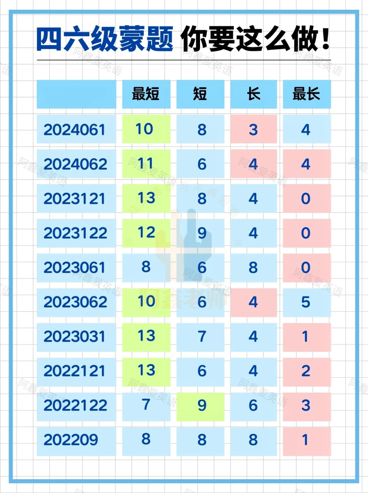
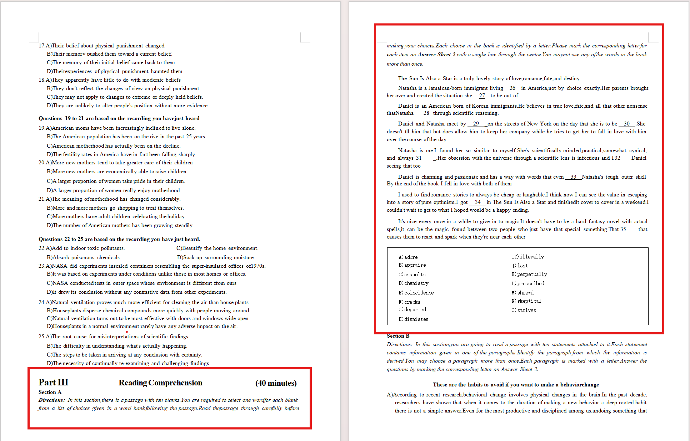
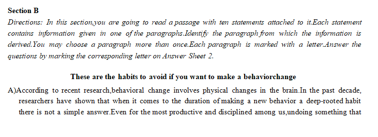
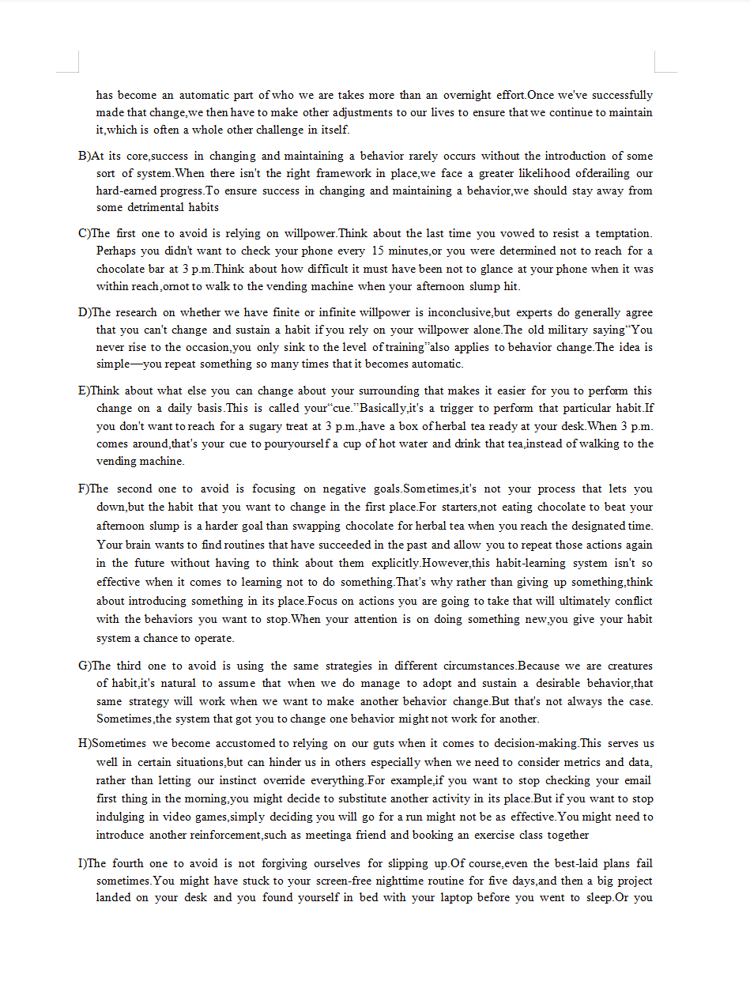
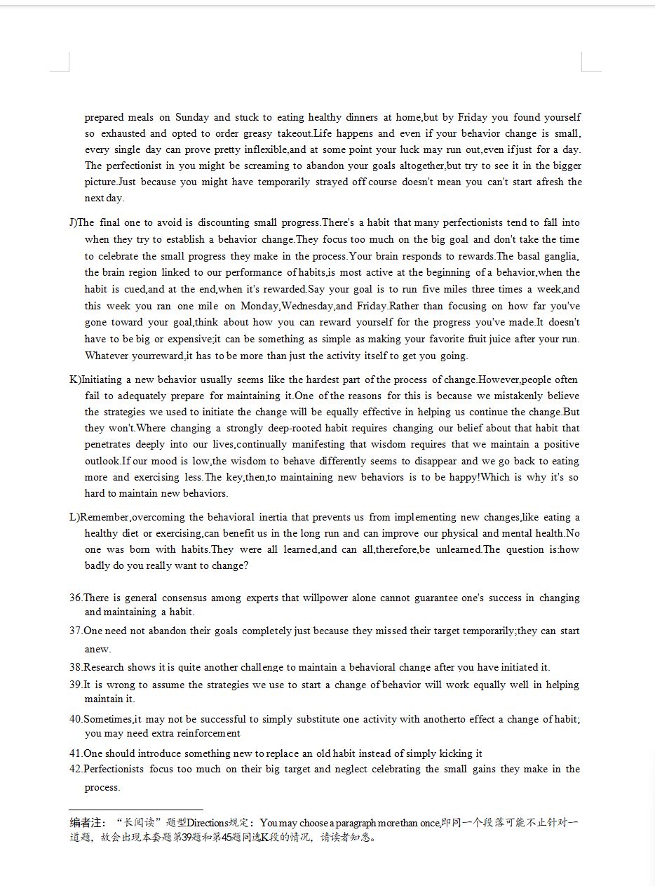
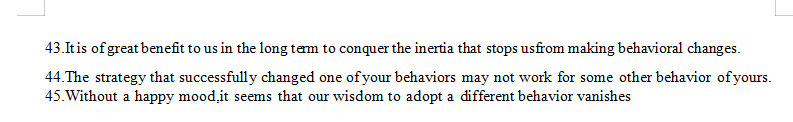

# 六级考试备考指南

个人认为，六级和四级真题几乎看不出任何区别

除了**单词**

唯一需要提前准备的也是**单词**

除了<u>A篇阅读</u>直接考察单词

命题人会在<u>题干、选项、文章关键段落</u>设置各种生单词，影响你的理解和判断。

个人感觉听力的选项有生单词，很可能会影响你理解的选项的意思，这就太要命了 :cry::fearful:

## 听力

需要注意的是：15:10发卷，在15:40之前你只能看**试题册**的封面（正面是一些注意事项，反面是Writing题目），不能打开试题册提前看听力的题目。15:40听力广播准时响，会先进行一分半的试音，你只有这些时间去读选项。

提前一周备考的小伙伴，建议把听力定为复习重点：真正上考场听力的时候特别容易慌，题目句子很长，生词多，读不完选项，这道题基本就要从头蒙到尾了。

很多人都说过一个寄巧：如果你听到的内容和这道题某一个选项重合度很高，那大概率就是这个选项。我用过，准确率还挺高的（

在xhs上，有人整了一个很抽象的东西,大伙看着图一乐得了

下面提供一些学长的做题技巧，大家自行甄别：

Y学长1：A篇，B篇听到什么选什么，C篇听到什么不选什么 :fist_oncoming:

Y学长2：ABCD四个选项均衡在6667:thinking:

## 阅读

#### 个人推荐顺序c->a->b

#### *注意：请大家务必相信自己长年累月积累下来的做题经验与方法。

##### 以下是我只是自己的一些做题方法，当你对英语阅读感到手足无措时，可以再去看这些文字。

 

#### c篇

大家高中英语课都做过阅读理解，所以按自己的节奏做就行，相信大家

 

 

#### a篇

选单词填空，由于是选择题，所以没有词性变化

##### 我的方法：

首先，看单词，把你不认识的圈出来。首先这样做心里就有底了，不管有多少生词都无所谓，然后就去看文章

##### 如何读文章

###### 第一段完整的看完，知道这篇文章讲的什么

下面的段落，没有空的直接跳过，有空的从头开始读，读到空时你凭上下文语境，就基本猜到了这个空填词的意思

填空时先看填词的词性，因为没有词性变化。再从单词库里选择，先排除没画圈的，再排除画圈的

 

#### b篇

段落匹配，文章是所有阅读中最长的，又没法像A篇那样跳读，所以完整做下来花的时间很多

**  <u>“长阅读”题型Directions规定：You may choose a paragraph more than once,即同一个段落可能不止针对一 道题，故会出现本套题第39题和第45题同选K段的情况，请读者知悉。</u>*

非常<u>*长长长长长长长长长长长长长长长长长长长长长长长长*</u>的样例展示：

 

##### 我的方法：

###### 先读3-5个段落，

读的过程中，标画，获取两个关键信息：1.篇文章讲的什么主题2.这篇文章的结构（3-5个段落可能会包含引言和第一个分论点）

###### 读完后，去看前3-5个选项，

通常你可以发现1、2个匹配选项；

###### 接着再读四分之一-三分之一的文章，读完剩下的选项

经验之谈，选项集中在后面比较多

###### 最后去读剩下的文章

此时，基本每读一个段落就能找到一个匹配

主打一个随心所欲，按自己舒服的方式去改变

 

 
